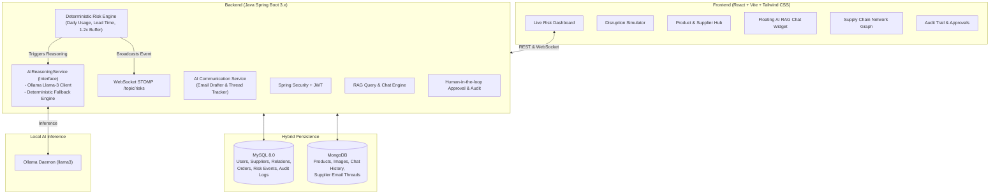

# Implementation Plan: SupplyGuard AI — Supply Chain Risk Intelligence Platform

Build **SupplyGuard AI**, an enterprise-grade AI-powered supply chain risk intelligence platform. The system continuously monitors inventory consumption rates and supplier statuses, computes deterministic stockout risks, triggers structured AI reasoning via Ollama (with a decoupled service layer and fallback resilience), drafts autonomous supplier communications, enforces human-in-the-loop approval, and displays live metrics on a modern, reactive dashboard.

---

## User Review Required

> [!IMPORTANT]
> **Database Credentials & Connectivity Verified**:
> - **MySQL 8.0**: Verified running locally on port `3306` (User: `root`, Password: `DB_PASSWORD` set in environment). A dedicated database `supplyguard_db` will be initialized automatically.
> - **MongoDB**: Verified running locally on port `27017`. Database `supplyguard_mongo` will store product catalog documents, images, supplier email threads, and AI chat sessions.
> - **AI Reasoning (Ollama)**: Local Ollama binary and models (`llama3:latest`, `llama3.2-vision:latest`) are detected. We will implement a resilient `AIReasoningService` interface with `OllamaReasoningServiceImpl` (REST integration with `http://localhost:11434/api/generate`) and a built-in deterministic expert rule-based fallback so the system remains 100% operational regardless of local GPU/Ollama daemon state.

> [!NOTE]
> **Email Sending Strategy**:
> We will provide a robust email dispatching service supporting Spring Boot Mail (`JavaMailSender`), SendGrid/OAuth-ready interfaces, and an interactive **Live In-App Mailbox & Simulation Console** where outgoing AI emails can be inspected, previewed, sent, and incoming supplier responses can be simulated or received via webhook.

---

## System Architecture

---

## Proposed Changes

### Backend: `supplyguard-backend` (Spring Boot 3.3+, Java 17)

#### Dependencies & Configuration
- **Build tool**: Maven (using verified working Maven 3.9 wrapper).
- **Dependencies**: `spring-boot-starter-web`, `spring-boot-starter-data-jpa`, `spring-boot-starter-data-mongodb`, `spring-boot-starter-security`, `spring-boot-starter-websocket`, `spring-boot-starter-mail`, `mysql-connector-j`, `jjwt-api`, `jjwt-impl`, `jjwt-jackson`, `lombok`.
- **Hybrid Data Configuration**: Dedicated JPA configuration for MySQL entities and Mongo configuration for document collections.

#### Data Models & Entities
1. **MySQL Entities** (`com.supplyguard.entity`):
   - `User`: ID, username, email, password, role (`ROLE_USER`, `ROLE_ADMIN`), createdAt.
   - `Supplier`: ID, name, contactEmail, phone, region, reliabilityScore (0.00-1.00), leadTimeDays, status (`ACTIVE`, `DISRUPTED`), trustScore, createdAt, updatedAt.
   - `ProductSupplier`: ID, productId (Mongo document reference ID), supplierId, isPrimary (boolean), unitCost, notes.
   - `RiskEvent`: ID, productId, productName, supplierId, supplierName, severity (`LOW`, `MEDIUM`, `HIGH`, `CRITICAL`), averageDailyUsage, daysUntilStockout, supplierLeadTimeDays, reason, aiRecommendation, aiReasoning, actionRecommended, actionApproved (Boolean), status (`OPEN`, `APPROVED`, `RESOLVED`, `DISMISSED`), createdAt, updatedAt.
   - `Order`: ID, productId, supplierId, quantity, status (`PENDING_APPROVAL`, `APPROVED`, `PLACED`, `DELIVERED`, `CANCELLED`), orderDate, expectedDeliveryDate.
   - `AuditLog`: ID, eventType, entityType, entityId, actionTaken, reasoningDetails, dataSnapshotJson, userApproved, approvedBy, timestamp.

2. **MongoDB Documents** (`com.supplyguard.document`):
   - `Product`: ID (String/ObjectId), name, category, description, imageBase64, launchDate, currentStock, recentUsage (List of 7 daily usage counts), reorderThreshold, primarySupplierId (Long), alternateSupplierIds (List of Long), createdAt, updatedAt.
   - `SupplierConversation`: ID, supplierId (Long), supplierName, riskEventId (Long), threadSubject, messages:
     - `MessageItem`: id, sender (`AI`, `SUPPLIER`, `USER`), body, timestamp, deliveryStatus (`DRAFT`, `PENDING_APPROVAL`, `SENT`, `RECEIVED`).
   - `AIChatSession`: ID, userId (Long), sessionId, title, messages:
     - `ChatMessage`: role (`user`, `assistant`, `system`), content, citations (List of entity references/metrics), timestamp.

#### Core Business Services
1. **`RiskEngineService`**:
   - Computes deterministic metrics:
     $$\text{averageDailyUsage} = \frac{\sum_{i=1}^{7} \text{recentUsage}_i}{7}$$
     $$\text{daysUntilStockout} = \frac{\text{currentStock}}{\text{averageDailyUsage} \times 1.2}$$
   - Severity classification:
     - Supplier is `DISRUPTED`: automatic escalation to `CRITICAL` (or `HIGH` if > 60 days buffer).
     - $\text{daysUntilStockout} \le \text{leadTimeDays}$: **`CRITICAL`** (Stockout occurs before regular shipment arrives).
     - $\text{daysUntilStockout} \le \text{leadTimeDays} \times 1.5$: **`HIGH`** (Dangerous buffer).
     - $\text{daysUntilStockout} \le \text{leadTimeDays} \times 2.5$: **`MEDIUM`** (Approaching reorder window).
     - Otherwise: **`LOW`**.
   - Automatic triggers: invoked on product stock updates, daily usage updates, supplier disruption/restoration toggles, or manual simulation events.
   - Saves/updates `RiskEvent` and pushes live update via `SimpMessagingTemplate` (`/topic/risks`).

2. **`AIReasoningService`** (Clean interface):
   - `generateRiskRecommendation(RiskContext context)`: Produces structured JSON / plain-text recommendation and step-by-step reasoning citing usage rates, buffer calculations, and alternate supplier lead times.
   - `generateSupplierEmailDraft(RiskContext context)`: Drafts professional, urgent procurement outreach email specifying exact needed quantities and delivery targets.
   - `answerRAGChatQuery(String question, List<RiskEvent> activeRisks, List<Product> products, List<Supplier> suppliers)`: Grounds AI responses in live inventory data.
   - Implementations: `OllamaReasoningServiceImpl` with resilient timeout handling and automatic fallback to `DeterministicHeuristicReasoningServiceImpl` if Ollama is starting up or offline.

3. **`CommunicationService`**:
   - AI drafts emails upon high/critical risk events.
   - Saves draft in MongoDB `SupplierConversation` with `deliveryStatus = PENDING_APPROVAL`.
   - On human approval, dispatches email (via JavaMailSender / SMTP / Mock Dispatcher) and updates conversation history.
   - Ingests incoming replies via webhook/simulation endpoint (`/api/suppliers/{id}/reply`) and updates risk event context.

4. **`HumanApprovalService` & `AuditLogService`**:
   - Provides endpoints for `approveAction(riskEventId)` and `rejectAction(riskEventId)`.
   - Executes the mitigation action: e.g., switches primary supplier to alternate, creates emergency purchase order, or sends approved email.
   - Records immutable audit trail entry in MySQL with complete state snapshot.

5. **`DataSeederService`**:
   - Automatically populates realistic, high-value supply chain data on first run:
     - Electronics, Medical Devices, Automotive & Aerospace parts.
     - Global suppliers (Active, Disrupted, High Reliability, Fast Lead Time).
     - Pre-calculated risk scenarios ready to demonstrate immediately.

---

### Frontend: `supplyguard-frontend` (React + Vite + Tailwind CSS)

#### Visual Identity & Design System
- **Theme**: Enterprise-grade Dark Mode with high-contrast emerald/amber/rose risk badges, frosted glass panels (`backdrop-blur-md bg-slate-900/80 border-slate-800`), sleek typography (Inter), micro-animations, and live pulse indicators.
- **Iconography**: `lucide-react` icons for clear visual hierarchy.

#### Core Modules & Pages
1. **Live Risk Overview Dashboard**:
   - Top KPI Banner: Total SKUs Monitored, Critical Stockout Threats, Disrupted Suppliers, Active Mitigations.
   - Real-time WebSocket Feed: Live stream of risk status changes with sound/visual alert toggles.
   - Severity Breakdown Cards with interactive filters.
2. **Product Catalog & Stock Health**:
   - Product list & grid view with category badges, stock levels vs reorder thresholds.
   - 7-day usage sparkline graph and stockout countdown indicator.
   - Product Add/Edit modal with image upload and supplier assignment.
3. **Supplier Directory & Trust Monitor**:
   - Suppliers table with regional flags, reliability score gauges, lead times, and Active/Disrupted toggle switches.
4. **Interactive Disruption Simulator ("Chaos Mode")**:
   - One-click disruption scenarios:
     - 🔴 "Disrupt Primary Supplier" (Factory fire, export ban, strike)
     - ⚡ "Black Friday Demand Spike" (+250% usage surge across 7 days)
     - 🚢 "Maritime Logistics Delay" (+14 days added to lead time)
   - Real-time before-and-after calculation view showing how the risk score and AI recommendation dynamically update.
5. **AI Reasoning & Decision Hub**:
   - Expandable reasoning view showing:
     - **Deterministic math breakdown**: formula, daily usage, buffer factor, lead time delta.
     - **AI Recommendation**: Plain-English mitigation advice.
     - **AI Reasoning**: Step-by-step logic and justification.
     - **Action Center**: One-click "Approve Mitigation", "Reject", or "Edit Action".
6. **Supplier Communications & Mailbox**:
   - Live conversation view showing AI-generated outreach drafts, sent emails, and supplier responses.
   - Simulated reply composer: test how the AI and system react when a supplier replies with delivery dates or price changes.
7. **Supply Chain Network Graph (Visual Topology)**:
   - Interactive SVG/Canvas node-link diagram connecting Products $\leftrightarrow$ Suppliers.
   - Nodes color-coded by health (Green = Safe, Yellow = Warning, Red = Disrupted/Critical).
8. **Site-Wide Floating AI Assistant**:
   - Floating chat button opening an intelligent conversational drawer.
   - Pre-canned prompts: *"What is our biggest stockout risk right now?"*, *"Why should we switch from Apex Circuits to Taiwan Micro?"*, *"List all products with under 10 days of inventory"*.
   - Cites live database metrics and links directly to relevant product/supplier pages.
9. **Audit Trail View**:
   - Filterable timeline of all AI recommendations, user approvals, and system state snapshots.

---

## Verification Plan

### Automated & Backend Verification
1. **Maven Build & Compilation**:
   - Run `./mvnw clean compile` to ensure all entities, repositories, services, and controllers compile cleanly without errors.
2. **Deterministic Risk Engine Unit Tests**:
   - Test average daily usage calculation with known 7-day arrays.
   - Test stockout formula $currentStock / (avgDailyUsage \times 1.2)$.
   - Verify low, medium, high, and critical boundary thresholds.
   - Verify supplier disruption status forces escalation.
3. **Database Integration Checks**:
   - Test MySQL connection and schema creation on `supplyguard_db`.
   - Test MongoDB connection and document storage on `supplyguard_mongo`.
4. **API Integration Tests**:
   - Test product CRUD endpoints.
   - Test supplier CRUD and disruption toggle endpoints.
   - Test risk recalculation trigger.
   - Test approval and audit logging.

### Manual End-to-End Verification
1. **Dashboard & WebSocket Test**:
   - Start backend (`mvn spring-boot:run`) and frontend (`npm run dev`).
   - Trigger a disruption in the frontend simulator and verify that the dashboard updates in real-time via WebSocket without full page refresh.
2. **AI Reasoning Verification**:
   - Inspect risk event to verify deterministic metrics match AI reasoning text.
3. **Email Outreach & Approval Flow**:
   - Review AI draft email in the communications hub.
   - Approve action and verify audit log entry creation.
   - Post simulated supplier reply and verify context update.
4. **AI Chat Agent Verification**:
   - Ask natural language questions in the floating widget and verify answers cite actual database values.
